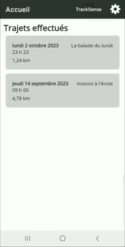

# Application mobile TrackSense
L'application mobile TrackSense permet de communiquer avec un objet connecté qui mesure votre position GPS et d'autres données sur vos trajets à vélo ou à pied. Les données d'un trajet peuvent être envoyées à l'application mobile via Bluetooth. L'application mobile permet d'enregistrer ces données dans une base de données. Elle permet aussi de consulter les informations sur vos trajets, notamment votre parcours dessiné sur une carte et des statistiques sur votre parcours.

Vous trouverez une procédure d'installation et des détails sur la conceptidon de l'application dans le [wiki](../../wiki/).

# Fonctionnement de l'application
L'application mobile permet de récupérer un trajet à partir de l'application embarquée et d'envoyer ce trajet vers l'API pour qu'il soit sauvegardé dans la base de données. Enfin, elle permet de consulter les trajets effectués.

## Page principale
Les trajets enregistrés dans la base de données sont affichés sur la page d'accueil. Chaque trajet est affiché dans un rectangle contenant des informations sommaires sur le trajet (date, distance, nom du trajet planifié).

Pour récupérer les trajets enregistrés dans la base de données, il suffit de tirer l'écran vers le bas.

Si aucun trajet n'est présent dans la base de données ou si vous n'êtes pas connecté à internet, aucun trajet ne pourra s'afficher.

Dans la barre d'outils, un bouton nommé TrackSense permet de passer à la page de connexion au TrackSense. Un autre bouton permet d'accéder aux paramètres de l'application.

## Page de connexion Bluetooth
Cette page est accessible en appuyant sur le bouton TrackSense de la page d'accueil. Dès la navigation, un scan d'une durée de une seconde est effectué, à l'issu duquel les appareil TrackSense à proximité sont affichés.

En cliquant sur un appareil, on peut s'y connecter. Si la connexion est établie, l'application mobile retourne à la page d'accueil.

Si un trajet a été effectué et est enregistré dans la mémoire du TrackSense, il sera envoyé automatiquement vers l'application mobile. Un bandeau s'affichera sur la page d'accueil le temps du transfert afin de demander à l'utilisateur de ne pas éteindre son TrackSense.

## Détails d'un trajet
En appuyant sur un trajet depuis la page d'accueil on navigue vers la page **Statistiques** qui permet de consulter des informations détaillées sur le trajet sélectionné.

## Paramètres
La page **Paramètres** permet de configurer l'appareil TrackSense et l'application mobile

# Bibliothèques
- Bluetooth: [dotnet-bluetooth-le](https://github.com/dotnet-bluetooth-le/dotnet-bluetooth-le/tree/master)
- Carte: [Mapsui](http://mapsui.com/documentation/getting-started-maui.html)

# Débogage

## Android

Il y a plusieurs solutions pour déboguer une application Android :

### Émulateur

|Avantage                |Désavantage                   |
|------------------------|------------------------------|
|Facile à mettre en place|Problèmes avec le bluetooth   |
|                        |Consomme beaucoup de ressource|

### Sous-système Windows pour Android (WSA) :

- Documentation : https://learn.microsoft.com/fr-fr/windows/android/wsa/
- Vidéo : https://www.youtube.com/watch?v=QpNYzigUdfg&ab_channel=JamesMontemagno
- Barista (Extension VS) : https://marketplace.visualstudio.com/items?itemName=Redth.WindowsSubsystemForAndroidVisualStudioExtension

|Avantage                               |Désavantage                |
|---------------------------------------|---------------------------|
|Lancement rapide (surtout avec Barista)|Requiert Windows 11        |
|                                       |Problèmes avec le bluetooth|

### Appareil Android local

- Documentation : https://developer.android.com/studio/debug/dev-options?hl=fr

|Avantage                |Désavantage                 |
|------------------------|----------------------------|
|Lancement rapide        |Requiert un appareil Android|
|Bluetooth fonctionnel   |                            |
|Facile à mettre en place|                            |

